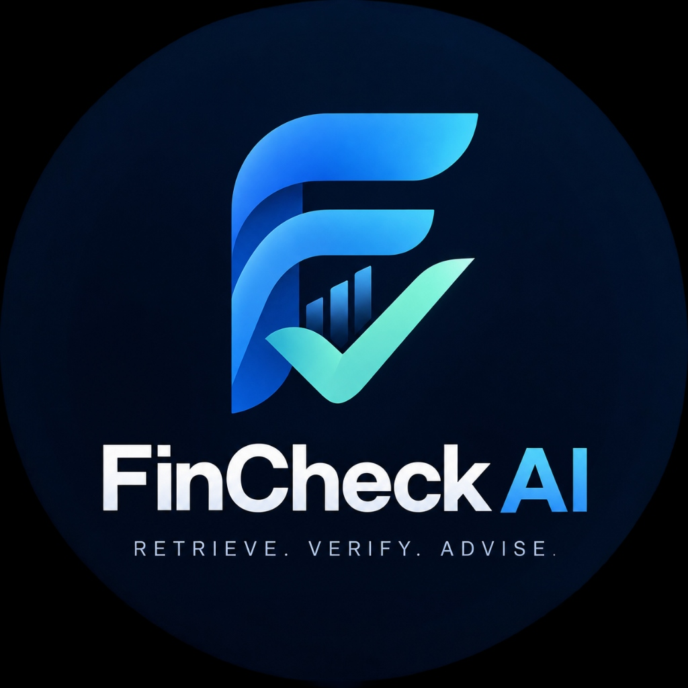

# FinCheck AI

<div align="center">



### **RETRIEVE. VERIFY. ADVISE.**

**AI-powered financial knowledge assistant for wealth managers, advisors, and compliance officers.**

[](https://nextjs.org/)
[](https://react.dev/)
[](https://www.typescriptlang.org/)
[](https://tailwindcss.com/)
[]()

</div>

---

## 📌 Table of Contents

- [Overview](#-overview)
- [Key Features](#-key-features)
- [Pages & Workflows](#-pages--workflows)
- [Tech Stack](#-tech-stack)
- [Repository Structure](#-repository-structure)
- [Getting Started](#-getting-started)
  - [Prerequisites](#prerequisites)
  - [Installation](#installation)
  - [Development Server](#development-server)
  - [Production Build](#production-build)
- [Compliance & Guardrails](#-compliance--guardrails)
- [Contributing & Author](#-contributing--author)

---

## 💡 Overview

**FinCheck AI** is an enterprise-grade AI financial assistant tailored for wealth management and private banking divisions. Financial advisors regularly field complex queries on investment policies, product prospectuses, tax rules, and compliance requirements.

Rather than relying on generic, hallucination-prone AI models, FinCheck AI is **strictly grounded in certified internal bank documents**. Every answer is synthesized directly from verified repositories and delivered with clickable, paragraph-level citations—ensuring that every piece of advice is accurate, verifiable, and audit-compliant.

---

## ✨ Key Features

- **Strict Document Grounding:** Restricts AI retrieval strictly to approved, certified bank documentation (Investment Policies, Product Brochures, Tax Guidelines, Compliance Frameworks).
- **Audit-Ready Paragraph Citations:** Every response features transparent source chips showing the document name, version tag, approved status, page reference, and exact section.
- **Hallucination Prevention & "Insufficient Info" Detection:** When internal policies do not contain sufficient evidence to answer a question, the assistant explicitly flags **"Insufficient Information"** rather than speculating.
- **Executive Analytics & KPIs:** Track total approved documents, inquiries answered, average AI usage confidence, and real-time knowledge base health.
- **Knowledge Base Management:** Document explorer categorizing internal assets with status filters (`Approved`, `Archived / Superseded`, `Pending Review`) and AI usage metrics.
- **Saved Answers Bookmarking:** Instant bookmarking of verified answers for client meetings, portfolio reviews, and compliance auditing.
- **Audit Trail & Query History:** Detailed log of all advisor questions tagged by category (`#suitability`, `#tax`, `#wealth`, `#compliance`).
- **Enterprise Security & Theming:** Crisp banking-grade user interface with collapsible navigation, user profiles, and configurable response styles.

---

## 🖥️ Pages & Workflows

| Route | Page | Description |
|---|---|---|
| `/` | **Sign In** | Branded enterprise portal showcasing key compliance guarantees and credentials access. |
| `/dashboard` | **Dashboard** | Mission control with KPI cards, quick-query search, category cards, and recent question log. |
| `/ask` | **Ask FinCheck AI** | Interactive Q&A workspace with streaming responses, clickable citations, copy/bookmark actions, and feedback. |
| `/knowledge-base` | **Knowledge Base** | Document repository explorer with category filtering, document status chips, and AI usage tracking. |
| `/recent-questions` | **Recent Questions** | Historical query log with filterable status (`Answered`, `Insufficient Info`) and tags. |
| `/saved-answers` | **Saved Answers** | Bookmarked answers library for fast recall during client consultations. |
| `/settings` | **Settings** | User profile, concise answer toggle, notification preferences, and system controls. |

---

## 🛠️ Tech Stack

- **Framework:** [Next.js 16 (App Router)](https://nextjs.org/)
- **Library:** [React 19](https://react.dev/)
- **Language:** [TypeScript 5](https://www.typescriptlang.org/)
- **Styling:** [Tailwind CSS v4](https://tailwindcss.com/) with PostCSS
- **Icons:** [Lucide React](https://lucide.dev/)
- **Fonts:** Geist Sans & Geist Mono (via `next/font`)
- **State Management:** React Context (`SidebarContext`) & React Hooks

---

## 📂 Repository Structure

```text
FinCheck AI/
├── README.md                      # Primary project documentation
├── fincheck-ai-app/               # Next.js web application
│   ├── app/                       # App Router pages and layouts
│   │   ├── ask/                   # AI Q&A consultation interface
│   │   ├── dashboard/             # Advisor dashboard & metrics
│   │   ├── knowledge-base/        # Document repository explorer
│   │   ├── recent-questions/      # Query audit trail & history
│   │   ├── saved-answers/         # Bookmarked answers
│   │   ├── settings/              # User preferences & profile
│   │   ├── globals.css            # Tailwind & global stylesheet
│   │   ├── layout.tsx             # Root layout with Geist font
│   │   └── page.tsx               # Login & authentication page
│   ├── components/
│   │   ├── layout/                # MainLayout, Sidebar, Header, SidebarContext
│   │   └── ui/                    # Reusable UI primitives (Badge, Card, KpiCard)
│   ├── lib/
│   │   └── mock-data.ts           # Enterprise mock dataset (policies, docs, Q&A)
│   ├── public/                    # Static assets, branding, and icons
│   ├── package.json               # Dependencies and scripts
│   ├── tsconfig.json              # TypeScript configuration
│   └── next.config.ts             # Next.js configuration
└── .gitignore                     # Git ignore rules
```

---

## 🚀 Getting Started

### Prerequisites

Ensure you have the following installed:
- **Node.js**: `v18.18.0` or higher (recommended: `v20.x` or `v22.x`)
- **npm** (`v9+`), **pnpm**, or **yarn**

### Installation

1. Clone the repository:
   ```bash
   git clone https://github.com/IshaRode/FinCheck-AI.git
   cd "FinCheck AI/fincheck-ai-app"
   ```

2. Install dependencies:
   ```bash
   npm install
   ```

### Development Server

Run the development server:

```bash
npm run dev
```

Open [http://localhost:3000](http://localhost:3000) with your browser to explore FinCheck AI.

> **Tip:** You can click **"Sign In"** directly from the login page to enter the advisory dashboard.

### Production Build

To test a production-optimized build:

```bash
npm run build
npm run start
```

To run linting:
```bash
npm run lint
```

---

## 🔒 Compliance & Guardrails

FinCheck AI enforces strict adherence to financial advisory governance:
1. **Certified Indexing:** Documents with `Archived` or `Pending Review` status are excluded from live answers or clearly demarcated.
2. **Citation Verifiability:** Answers cite specific document versions and section headers to allow cross-checking against official PDFs.
3. **No Speculation:** When source material does not address a client inquiry, the system explicitly communicates that data is missing rather than attempting to interpolate.

---

## 👤 Author

Developed by **Isha Rode**.
